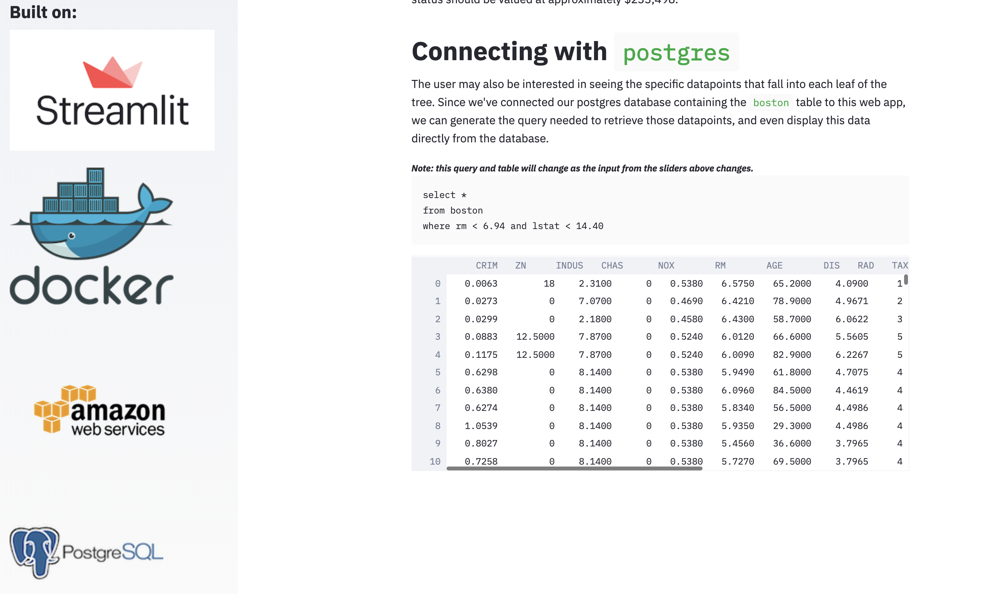

# Containerized [Streamlit](https://www.streamlit.io/) web app

This repository is featured in a 3-part series on [Deploying web apps with Streamlit, Docker, and AWS](https://collinprather.github.io/blog/docker/aws/2020/03/10/streamlit-docker-pt1.html). Checkout the blog posts!



---

## Setup instructions

If you are interested in the single-container web app (not backed by a Postgres database), checkout out the [`master` branch](https://github.com/collinprather/streamlit-docker). 

### Getting up and running locally

Run the following from your command line. 

```shell
$ git clone https://github.com/collinprather/streamlit-docker.git
$ cd streamlit-docker/
$ git checkout docker-compose+postgres
$ echo 'POSTGRES_USER=<username>
POSTGRES_PASSWORD=<password>
POSTGRES_DB=<db_name>' > .env
$ docker-compose up -d
Creating network "streamlit-docker_default" with the default driver
Creating streamlit ... done
Creating postgres  ... done
$
```

Be sure to replace anything between `<` and `>` with your own input. For example,

```shell
$ echo 'POSTGRES_USER=streamlit_app
POSTGRES_PASSWORD=youll_never_guess_this
POSTGRES_DB=streamlit_db' > .env
```

Then, the web app will be available at `http://localhost:8501/`

To shut down the web app when you're done, 

```shell
$ docker-compose down
Stopping postgres  ... done
Stopping streamlit ... done
Removing postgres  ... done
Removing streamlit ... done
Removing network streamlit-docker_default
$
```

### Deploying to the cloud

Refer to my [blog post](https://collinprather.github.io/blog/docker/aws/2020/03/11/streamlit-docker-pt2.html)!