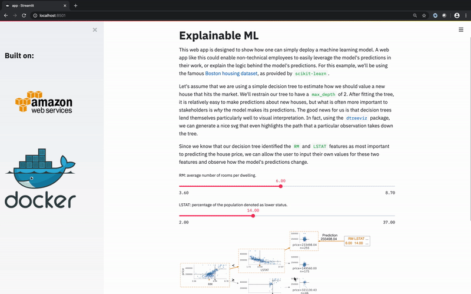

# Containerized [Streamlit](https://www.streamlit.io/) web app

This repository is featured in a 3-part series on [Deploying web apps with Streamlit, Docker, and AWS](https://collinprather.github.io/blog/docker/aws/2020/03/10/streamlit-docker-pt1.html). Checkout the blog posts!



---

## Setup instructions

If you are interested in the web app backed by a Postgres database, checkout out the [`docker-compose+postgres` branch](https://github.com/collinprather/streamlit-docker/tree/docker-compose+postgres). 

### Getting up and running locally

```shell
$ git clone https://github.com/collinprather/streamlit-docker.git
$ cd streamlit-docker/
$ docker image build -t streamlit:app .
$ docker container run -p 8501:8501 -d streamlit:app
```

Then, the web app will be available at `http://localhost:8501/`

To shut down the web app when you're done, you can find the process running your container with

```shell
$ docker ps | grep 'streamlit:app'
6d1871137019        streamlit:app       "/bin/sh -c 'streaml…"   8 minutes ago       Up 8 minutes        0.0.0.0:8501->8501/tcp   <weird_name>
```

Then stop that process with the following command.

```shell
$ docker kill <weird_name>
<weird_name>
$
```

### Deploying to the cloud

Refer to my [blog post](https://collinprather.github.io/blog/docker/aws/2020/03/11/streamlit-docker-pt2.html)!
